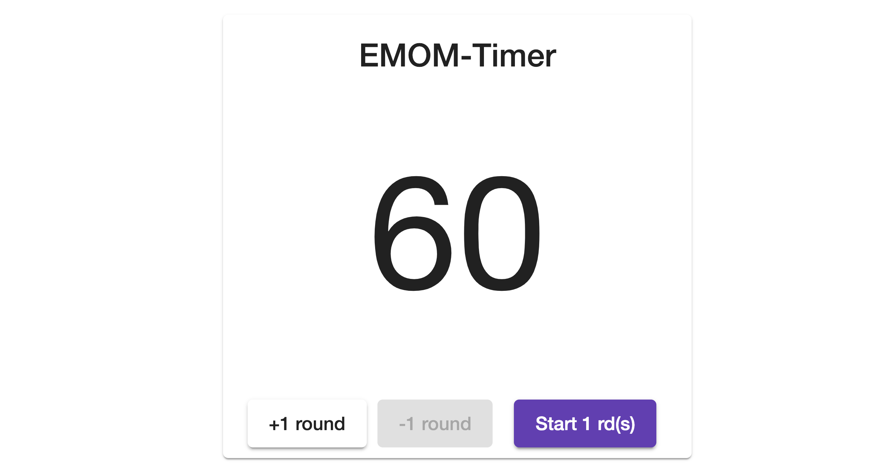

# EMOM-Timer

This project was generated with [Angular CLI](https://github.com/angular/angular-cli) version 7.1.4 and uses [Angular Material](https://material.angular.io/).

It is a **Progressive Web App**. Download the app from the browser and use it offline.

[](https://emom-timer.herokuapp.com)

## Development server

Run `ng serve` for a dev server. Navigate to `http://localhost:4200/`. The app will automatically reload if you change any of the source files.

## Code scaffolding

Run `ng generate component component-name` to generate a new component. You can also use `ng generate directive|pipe|service|class|guard|interface|enum|module`.

## Build

Run `ng build` to build the project. The build artifacts will be stored in the `dist/` directory. Use the `--prod` flag for a production build.

## Running unit tests

Run `ng test` to execute the unit tests via [Karma](https://karma-runner.github.io).

## Running end-to-end tests

Run `ng e2e` to execute the end-to-end tests via [Protractor](http://www.protractortest.org/).

## Publish on GitHub Pages

GitHub Pages needs static files. They are generated with `ng build`. This command creates a `dist/EMOM-Timer` folder. 
The project includes a package called [angular-cli-ghpages](https://www.npmjs.com/package/angular-cli-ghpages) in the dev dependencies. The package tells GitHub Pages where to find the static files.

To build and publish run `npm run publish`.

## Deploy on Heroku

It is possible to deploy static files to Heroku by using **buildpacks** ([heroku-buildpack-static](https://github.com/heroku/heroku-buildpack-static)). The [Getting Started](https://gist.github.com/hone/24b06869b4c1eca701f9) Guide is a handy manual for everything you need to know. 

Buildpacks require the `dist` folder to be committed. That's why is not ignored in `.gitignore`.

```
$ ng build --prod
$ git add .
$ git commit -m "Commit message"
$ git push heroku master
$ heroku open
```
Visit [https://emom-timer.herokuapp.com](https://emom-timer.herokuapp.com).


## Acknowledgement

The project is based on [this tutorial](https://medium.com/@nsmirnova/creating-pwa-with-angular-5-e36ea2378b5d).